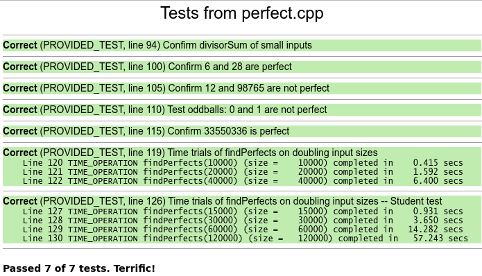
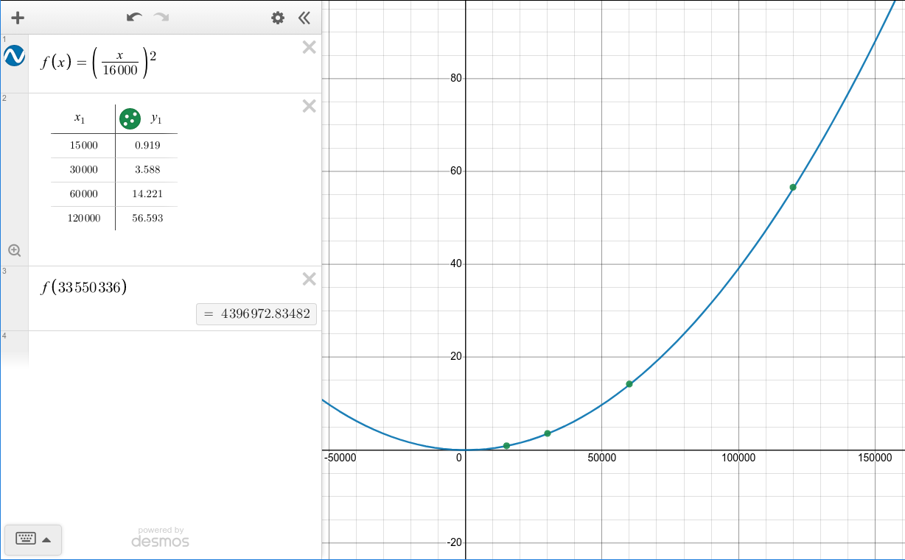
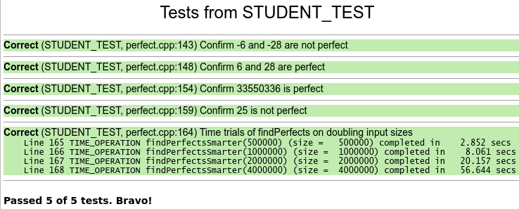
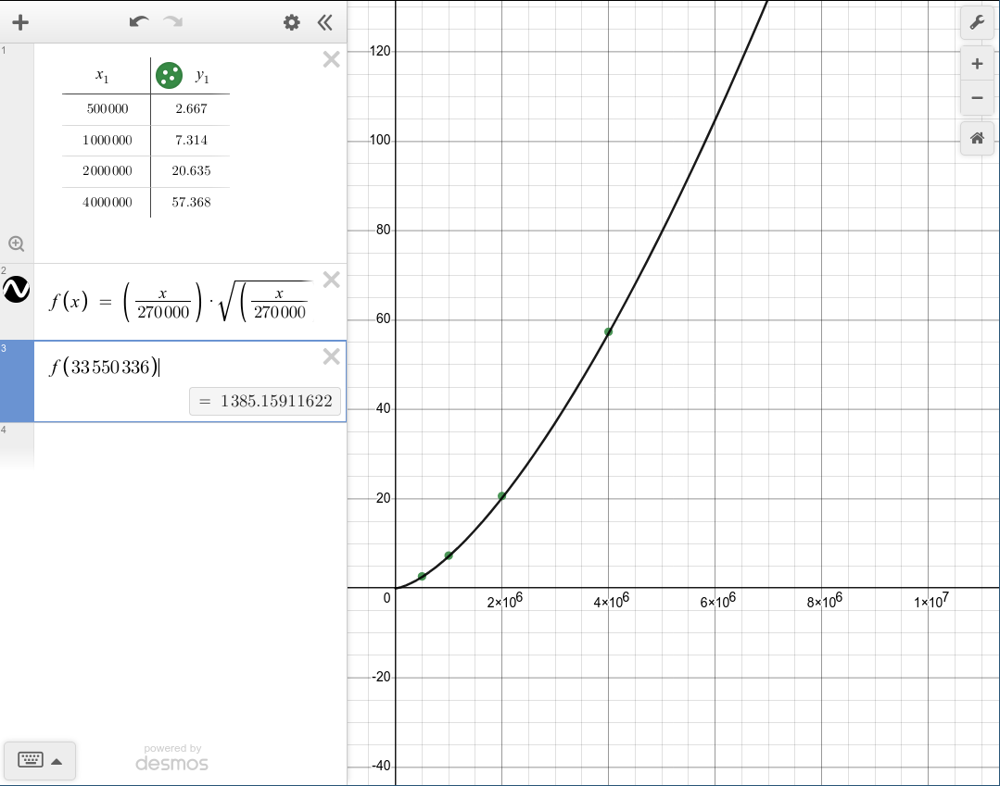

### Q1:

执行时间见下图：



执行找到四个完全数，包括6，28，496 和 8128。

### Q2:

`findPerfects` 执行时间为：

| number | time (s) |
|--------|----------|
| 15000  | 0.931    |
| 30000  | 3.650    |
| 60000  | 14.282   |
| 120000 | 57.243   |

作图如下：



### Q3

对于 10 和 1000 计算 `isPerfect` 工作量不一样多，因为对于函数（`divisorSum(n)`）随着数字（`n`）的变大需要更多枚举的数字（`divisor < n, divisor++`）用于计算 `n ?% divisor`。另一方面，更大的数字理论上也会占用更多的内存，但是不是主要影响速度的原因。

对于 1-1000 和 1000-2000 这两个区间，对于计算 `findPerfect()` 函数则工作量相差不大，因为都只执行了相同次数的函数包括 `isPerfect()` 过程。

### Q4

由 Q2 计算 $f(33550336)$ 时间约为 4396972 秒。

### 深入测试

`total` 的初始值从 0 改为 1，测试错误如下：

```
Incorrect (PROVIDED\_TEST, perfect.cpp:94) Confirm divisorSum of small inputs
Line 95: EXPECT_EQUAL failed: divisorSum(1) != 0
divisorSum(1) = 1
```

### Q5

其他测试不能通过，因为改变 `total` 的初始值会造成 `divisorSum()` 的计算错误。

### Q6

测试策略包括以下几个方面：

1. 负数测试
2. 完全数的测试
3. 非完全数的测试
4. 边缘测试，平方数的测试
5. 速度测试

### Q7

测试结果见下图：

 

时间测试结果如下表格：

| number  | time (s) |
|---------|----------|
| 500000  | 2.667    |
| 1000000 | 7.314    |
| 2000000 | 20.635   |
| 4000000 | 57.368   |

### Q8

将 Q7 中数据做曲线的手动估计拟合，得到函数关系如下图：

 

可以计算出 `findPerfectsSmarter` 找到第五个完全数需要大约 1385 s。


### Q9

```cpp
// student test for findNthPerfectEuclid()
STUDENT_TEST("Confirm find -1 perfect number is ok."){
    EXPECT(!isPerfect(findNthPerfectEuclid(-1)));
}

// edged test

STUDENT_TEST("Confirm find 0 perfect number is will not make troubles."){
    EXPECT(!isPerfect(findNthPerfectEuclid(0)));
}

STUDENT_TEST("Confirm find 5 perfect number is ok." ){
    EXPECT(isPerfect(findNthPerfectEuclid(5)));
}

// large number calculation test
STUDENT_TEST("Confirm find 6 perfect number is ok." ){
    EXPECT(isPerfect(findNthPerfectEuclid(6)));
}
```

`findNthPerfectEuclid(-1)`  --> 负值检测，虽然一般不会用到，防止出现奇怪问题；

`findNthPerfectEuclid(0)`  --> 同上；

`findNthPerfectEuclid(5)` --> 正常检测；

`findNthPerfectEuclid(6)` --> 机器能力内，较大计算量的压力测试。


